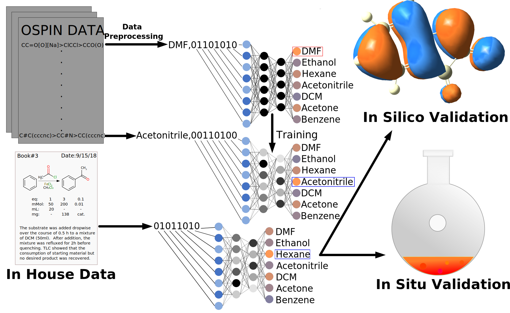

# Solvent-MLP



## Use of Conda and Dependencies

If one wishes to replicate the MLP training or plotting, a Conda enviornment is provided and can be used by the comand:
```bash
conda env create -f solvent.yml
```
Scripts can then be run in Python once Conda has been downloaded and the solvent enviornment has been created.

##External Data
Multiple files are hosted externally due to size limitations.
For accessing the parsed USPTO reaction SMILES, the Daniel Lowe [figshare repo](https://figshare.com/articles/dataset/Chemical_reactions_from_US_patents_1976-Sep2016_/5104873) should be used.

## Training

If one wishes to replicate the k-fold training of MLPs, a script is provided for such. This should be run from the root directory from this repo as:
```bash
python training-scripts/k-fold-training.py
```

## Plotting

If one wishes to replicate plotting results they should again be run from the root directory.
